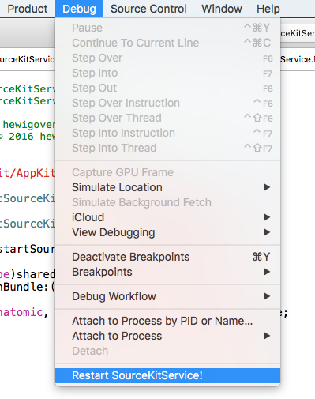

### Introduction

Xcode stop highlighting your Swift code? Try Debug -> Restart SourceKitService!

### How


```applescript
do shell script "sudo killall SourceKitService" with administrator privileges
```

### Screenshot
